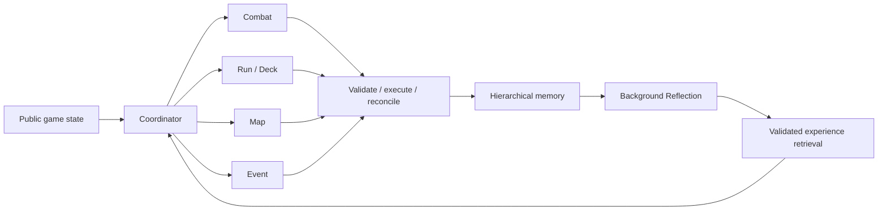

# SpireMind

[English](README.md) | [简体中文](README.zh-CN.md)

[](https://github.com/optima-xu/SpireMind/actions/workflows/test.yml)
[](https://www.python.org/)
[](LICENSE)

A multi-agent player for **Slay the Spire 2**, with specialized decision agents, hierarchical memory, evidence-backed experience learning and recoverable execution.

## Quick Start

Live play targets **Windows, STS2 v0.111.0 and standard single-player runs**. Ironclad A0 has the most live validation; the other characters have strategy packages. Modded saves are separate from vanilla saves.

### 1. Install

Install [Git for Windows](https://git-scm.com/downloads/win), then **close the game** and open PowerShell:

```powershell
git clone https://github.com/optima-xu/SpireMind.git
Set-Location SpireMind
powershell -NoProfile -ExecutionPolicy Bypass -File scripts/setup.ps1
```

Setup finds Steam libraries, prepares Python 3.13 and locked dependencies, creates configuration templates, and builds/installs the pinned STS2AIMCP bridge. Missing uv and .NET 9 SDK are obtained through their official installers. Existing `.env` and `config.local.toml` are preserved.

If the game is not found, specify its directory:

```powershell
powershell -NoProfile -ExecutionPolicy Bypass -File scripts/setup.ps1 -GameRoot 'D:\SteamLibrary\steamapps\common\Slay the Spire 2'
```

For a demo without installing the game bridge, add `-Offline`; dependency downloads still require internet access. For the Alibaba Cloud template, add `-Provider deepseek`. See [installation details](docs/DEPLOYMENT.md).

### 2. Configure your model

```powershell
notepad config.local.toml
notepad .env
```

Set `base_url` and `model` in `config.local.toml`; put your key in the environment variable named by `api_key_env` in `.env`. The default template uses `OPENAI_API_KEY`. The provider must support OpenAI-compatible Chat Completions, JSON decisions and function tools. These files are loaded automatically; process environment variables take precedence.

You can try the offline walkthrough first, without a key:

```powershell
.\spiremind.cmd start --environment mock --policy rules
```

### 3. Start from the game's main menu

Launch the game through Steam, enable **STS2AIMCP**, and leave it at the **main menu**. Keep the agent's terminal open:

```powershell
.\spiremind.cmd doctor
.\spiremind.cmd start --character ironclad --ascension 0
```

`--character` accepts `ironclad`, `silent`, `regent`, `necrobinder` or `defect`. `--ascension 0` is base difficulty; select another unlocked level, such as `--ascension 5`. Only combinations offered by the current game are accepted. Card knowledge is synchronized automatically.

**If the game is not at the main menu, `start` tells you to return there before starting.** If a saved run is available, use `resume` to continue it; starting a different character/difficulty requires finishing or abandoning that run in the game first.

### 4. Pause and resume

Open another PowerShell window in the same project directory:

| Command | Purpose |
| --- | --- |
| `.\spiremind.cmd pause` | Request a pause at the next safe boundary. |
| `.\spiremind.cmd status` | Check whether the agent is running, paused or stopped. |
| `.\spiremind.cmd resume` | Resume a paused agent; if it has stopped, reconnect to the current unfinished run. |
| **Ctrl+C** in the agent terminal | Stop the process and preserve memory, trace and pending-action evidence. |
| `.\spiremind.cmd observe` | Read the current public game state. |
| `.\spiremind.cmd --help` | List commands and options. |

Pause waits for an ongoing model request or game action to settle. Wait until `status` shows `paused` before manually interacting with the game. Resume reads fresh state and discards any decision computed before the pause. Do not run a second agent on the same bridge. Model reflection, when explicitly enabled, may finish a background job while game decisions are paused.

[Full command reference](docs/COMMANDS.md) includes single-step execution, replay, memory maintenance and benchmarks. Python users can use `uv run spiremind ...` on Windows or Linux; live bridge setup here is for Windows.

## Technical Report

### Agent architecture



The Coordinator routes one specialist per decision and owns execution. Agents share a provider but have separate tasks, visible memory and write permissions. Scene handoffs carry verified resource changes and policy versions; Reflection has no game execution port.

### Memory and learning

**Working** memory is private to a run instance, agent and task. **Run** memory shares owned policies across scenes. **Episodes** record verified local transitions. **Skills** contain human rules and learned conditional observations.

Historical traces and future runs feed the same learning loop: observation → reflection → evidence checks → regression across at least three independent seed groups → activation → retrieval. Verified counterexamples deactivate a lesson. SQLite FTS5/BM25 retrieves at most two episodes and three active skills within 600 estimated tokens. The public training set contains 686 observations and reproduces two validated local lessons; this is experience learning, not model-weight training.

### Performance and reliability

Bounded LRU caches, one combat assessment per decision, a dedicated SQLite thread, combined transactions and a bounded logging queue reduce repeated work. Pending actions are persisted before dispatch; uncertain results are reconciled before another mutation. HTTP attempts have budget reservations, bounded retries and one JSON repair using existing calculator results.

| Metric | Measured change |
| --- | --- |
| Offline preparation P50 | 3.306 → 1.078 ms, **−67.4%** |
| Preparation including async storage | 2.313 ms, **−30.0%** vs baseline |
| Repeated card queries | 546 → 16, **−97.1%** |
| Median estimated combat-context tokens | 6648 → 5647, **−15.1%** |

Measurements use 16 public states and three repeated comparisons at the source revisions recorded in the [performance report](docs/PERFORMANCE.md). Model testing stopped within budget with four complete A/B/C groups. These results do not establish improved win rate. CI covers Windows/Linux and Python 3.11/3.13, including cancellation, rollback, cache invalidation, pending recovery and isolated wheel installation.

Details: [memory design](docs/MULTI_AGENT_MEMORY.md) · [interview notes and resume bullets](docs/INTERVIEW.md) · [live validation scope](docs/ACCEPTANCE.md) · [contributing](CONTRIBUTING.md).
