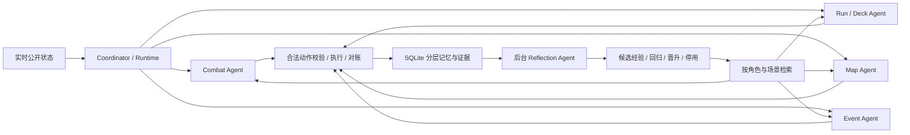

# SpireMind

[](https://github.com/optima-xu/SpireMind/actions/workflows/test.yml)
[](https://www.python.org/)
[](LICENSE)

**面向长任务的多 Agent 决策系统：专业分工、分层记忆、经验检索与可靠执行。**

《杀戮尖塔 2》提供了一个具体问题：战斗、选牌、商店和地图需要不同的推理方式，却共同影响一局游戏。模型会重复计算、忘记先前计划，也可能把不确定的执行结果记成成功。SpireMind 让四个决策 Agent 按场景协作，由独立 Reflection Agent 提炼有证据的经验，Coordinator 统一负责动作校验、执行与恢复。

An observable multi-agent runtime for long-horizon decisions, with scoped memory, evidence-backed experience learning, bounded asynchronous I/O and reproducible offline benchmarks.

当前实机适配目标是 Windows / STS2 v0.111.0 / 铁甲战士 A0；其余角色有通用接口与策略包。此次改造使用历史公开状态和离线回归，**没有操作真实游戏，也没有证明胜率提高**。既有局面的实机范围见 [验收记录](docs/ACCEPTANCE.md)。

## 先看演示

```powershell
git clone https://github.com/optima-xu/SpireMind.git
Set-Location SpireMind
uv sync --locked
uv run spiremind run --environment mock --policy rules
uv run spiremind benchmark --rounds 5
```

无需 API key。Mock 是固定场景序列，覆盖主菜单到终局的 10 个已核验动作，用于验证控制链；它不是胜率模拟器。`benchmark` 默认离线，只有显式 `--use-model` 才发出模型请求。

从公开训练观察重建经验库：

```powershell
uv run spiremind memory --database runs/demo-memory.sqlite import src/spiremind/knowledge/benchmarks/training_evidence.json
uv run spiremind memory --database runs/demo-memory.sqlite consolidate
uv run spiremind memory --database runs/demo-memory.sqlite inspect
uv run spiremind benchmark --memory-db runs/demo-memory.sqlite --rounds 5
```

686 条脱敏训练观察能重建两条有跨局支持的条件经验：特定条件下防御牌的格挡变化，以及一次选牌后的牌组数量变化。它们是可检查的局部观察，不能据此判断某张牌值得购买，或某个动作最优。完整历史导入可使用 `memory import runs`；同一份材料重复导入不会重复计数。

## 实测收益

三次独立测量的摘要：离线准备 P50 **3.306 → 1.078 ms（下降 67.4%）**；包含 SQLite worker 调度的 P50 为 **2.313 ms（较基线下降 30.0%）**。重复牌库查询 **546 → 16（下降 97.1%）**；战斗上下文估计 token 中位数 **6648 → 5647（下降 15.1%）**。这些是本地固定数据集结果。

固定 16 个公开局面覆盖战斗、奖励、商店、地图、事件、休息和选牌。性能报告区分准备计算、异步线程调度、经验检索、日志排空和模型 HTTP 耗时。每份结果都有源码、数据集、配置和冻结记忆指纹。具体样本、三次重复测量、预算与模型对照见 [性能报告](docs/PERFORMANCE.md)。

## 多 Agent 如何协作



每次决策只路由一个主 Agent；场景切换的交接由代码生成，不增加一轮决策模型调用。模型客户端可以共享，Agent 的任务、可见记忆与写入权限分别定义。后台复盘与当前决策异步协作，游戏动作由单一执行链提交。

| 层级 | 作用与边界 |
| --- | --- |
| Working | 按实际对局实例、Agent、任务隔离；旧 revision 的行动计划失效。战斗内选牌延续 Combat 的目标。 |
| Run | 整局共享但按角色投影；Run 管 boss / gold / potion 策略，Map 管路线偏好；路线展望由代码计算。 |
| Episode | 保存可核验的局部前后变化及生产者、消费者、交接证据；区分执行成功与策略价值。 |
| Skill | 人工规则与学习经验分开；候选经验默认不注入，跨至少三个独立种子组支持并通过确定性回归后才激活。 |

相同 seed 的新开局使用新的实例 UUID；续跑保留实例。共享更新带生产者和策略版本，未授权或过期更新进入审计。出现已验证反例时停用经验，并保存历史版本。

检索采用 SQLite FTS5/BM25 与版本、角色、Agent、场景等过滤，最多两条 Episode、三条激活 Skill，总上限 600 个估计 token。旧局的 action_id 和执行参数不会作为可执行动作注入；当前合法动作来自实时状态。详见 [记忆与协作设计](docs/MULTI_AGENT_MEMORY.md)。

## 真正接入执行链的技术

- **有界 LRU**：牌库 1,024 条、牌组分析与策略适配各 128 条、经验检索 256 条；版本、升级、牌组、遗物和知识变化进入键或失效条件。HP readiness 每次重算。
- **计算复用**：效果解析、搜索、评估分别维护；每个战斗决策只做一份评估，供安全规则、提示词和回退共用。公开事实解码仍返回独立数据。
- **异步存储与事务**：SQLite 在专用单线程内创建、访问和关闭；Run、Working、快照、更新审计和对应经验提交在同一事务中。旧库使用增量迁移。
- **生产者—消费者**：日志队列容量 256，单消费者复用句柄，每批最多 32 条；背压、失败传播、退出和取消排空均有回归覆盖。
- **可靠动作与预算**：关键 pending 记录先持久化再发送；超时先对账；每个 HTTP 请求前预留预算，缺失 usage 时保守计费。无效最终 JSON 最多修复一次，复用已有计算器结果。

这些设计的具体取舍、常见面试追问及中英文简历描述见 [面试说明](docs/INTERVIEW.md)。

## 配置与运行

复制 `config.example.toml` 或 `config.deepseek.example.toml` 到 `config.local.toml`，把密钥放在配置指定的环境变量中。OpenAI-compatible `/chat/completions` 支持 `calculate` function calling；表达式只由有界算术解释器执行。

```powershell
uv run --env-file .env spiremind --config config.local.toml probe-model
uv run --env-file .env spiremind --config config.local.toml run --environment mock --policy model
```

Thinking 由配置决定；本次真实对照保持 `deepseek-v4-flash-0731`、thinking 开启、calculator required 一致。基线与优化提示共用传输实现，以分离提示与记忆的影响。实机桥接安装、只读观察、存档与故障排查见 [部署指南](docs/DEPLOYMENT.md)、[bridge.lock.json](bridge.lock.json)。

默认未来运行会保存局部经验并离线自动复盘。需要模型复盘时，在本地配置加入：

```toml
[memory]
reflection_use_model = true
reflection_requests = 4
reflection_tokens = 12000
```

复盘受每次运行的子预算与总 token 预算共同约束；容量 8 的队列满时保留数据库 pending 作业，下次运行恢复。Reflection 没有游戏执行接口。

## 验证与贡献

```powershell
uv run ruff check src tests scripts
uv run ruff format --check src tests scripts
uv run pytest -q
uv build
uv run python scripts/smoke_wheel.py
```

CI 覆盖 Windows/Linux 与 Python 3.11/3.13，检查确定性行为与隔离 wheel 演示；耗时收益由重复测量验收，不作为波动敏感的 CI 阈值。贡献说明见 [CONTRIBUTING](CONTRIBUTING.md)，安全边界见 [SECURITY](SECURITY.md)，第三方资料说明见 [THIRD_PARTY_NOTICES](THIRD_PARTY_NOTICES.md)。本地配置、密钥、原始运行日志、SQLite 和存档备份均不提交。
