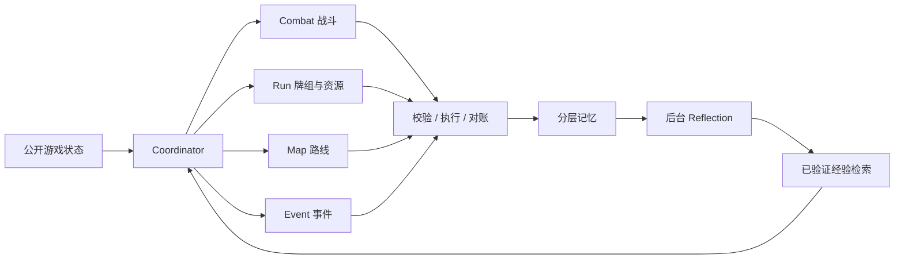

# SpireMind

[English](README.md) | [简体中文](README.zh-CN.md)

[](https://github.com/optima-xu/SpireMind/actions/workflows/test.yml)
[](https://www.python.org/)
[](LICENSE)

为《**杀戮尖塔 2**》设计的多 Agent 决策系统：专业分工、分层记忆、基于证据的经验学习与可恢复执行。

## Quick Start

实机适配 **Windows、STS2 v0.111.0、标准单人模式**。铁甲战士 A0 的实机验证最多，其余角色提供策略包。模组存档与原版存档分开。

### 1. 安装

先安装 [Git for Windows](https://git-scm.com/downloads/win)，**关闭游戏**，在 PowerShell 中执行：

```powershell
git clone https://github.com/optima-xu/SpireMind.git
Set-Location SpireMind
powershell -NoProfile -ExecutionPolicy Bypass -File scripts/setup.ps1
```

安装脚本自动查找 Steam 游戏目录，准备 Python 3.13 和锁定依赖、创建配置模板，并构建和安装固定版本的 STS2AIMCP 桥接。缺少 uv 或 .NET 9 SDK 时，通过官方安装器补齐。已有 `.env` 和 `config.local.toml` 会保留。

如果没有找到游戏，指定安装目录：

```powershell
powershell -NoProfile -ExecutionPolicy Bypass -File scripts/setup.ps1 -GameRoot 'D:\SteamLibrary\steamapps\common\Slay the Spire 2'
```

只体验离线演示时加 `-Offline`，跳过游戏桥接；依赖下载仍需要网络。使用阿里云模板时加 `-Provider deepseek`。更多安装细节见[部署指南](docs/DEPLOYMENT.md)。

### 2. 配置模型

```powershell
notepad config.local.toml
notepad .env
```

在 `config.local.toml` 填写服务地址 `base_url` 和模型名 `model`，在 `.env` 填写 `api_key_env` 指定的密钥变量；默认模板使用 `OPENAI_API_KEY`。模型接口需要支持 OpenAI-compatible Chat Completions、JSON 决策和 function tools。配置文件会自动加载，已有进程环境变量优先。

没有密钥也可以先跑离线演示：

```powershell
.\spiremind.cmd start --environment mock --policy rules
```

### 3. 从游戏首页启动

从 Steam 打开游戏，启用 **STS2AIMCP** 模组，停留在**首页／主菜单**。保持 Agent 所在终端打开：

```powershell
.\spiremind.cmd doctor
.\spiremind.cmd start --character ironclad --ascension 0
```

`--character` 可选 `ironclad`、`silent`、`regent`、`necrobinder`、`defect`。`--ascension 0` 是基础难度，也可选择已解锁的进阶，例如 `--ascension 5`。角色与难度必须存在于当前游戏提供的选项中。启动时自动同步牌库。

**如果游戏不在首页，`start` 会提示先返回首页，不会直接接管当前场景。** 首页有未完成对局时，使用 `resume` 继续；想换角色或难度开新局，需要先在游戏内完成或放弃原对局。

### 4. 暂停与继续

在同一项目目录打开另一个 PowerShell 窗口：

| 命令 | 用途 |
| --- | --- |
| `.\spiremind.cmd pause` | 请求在下一个安全边界暂停。 |
| `.\spiremind.cmd status` | 查看运行、暂停或停止状态。 |
| `.\spiremind.cmd resume` | 继续暂停的 Agent；进程已停止时，重新连接当前未完成对局。 |
| 在 Agent 终端按 **Ctrl+C** | 停止进程，保留记忆、日志和待核对动作。 |
| `.\spiremind.cmd observe` | 只读取当前公开游戏状态。 |
| `.\spiremind.cmd --help` | 查看命令与参数。 |

暂停会等待正在进行的模型请求或游戏动作结束。需要手动操作时，先确认 `status` 显示 `paused`；继续时会重新读取状态，丢弃暂停前算出的决策。同一桥接只允许一个 Agent 写进程。显式开启模型复盘时，游戏决策暂停期间，后台复盘可能仍会完成已有作业。

关闭步数、时间和累计 token 上限可使用 `start --no-limits`，或在进程停止后使用 `resume --no-limits`。也可在配置的 `[runtime]` 中将相应字段设为 `false`，详见完整命令表。

[完整命令表](docs/COMMANDS.md)包含单步执行、日志回放、记忆维护和评测。Python 用户也可在 Windows/Linux 使用 `uv run spiremind ...`；这里的实机安装流程针对 Windows。

## 技术报告

### 多 Agent 架构



Coordinator 每次路由一个专业 Agent，并统一负责执行。Agent 可共享模型客户端，但任务、可见记忆和写入权限分别定义。场景交接携带已核验的资源变化和策略版本；Reflection 没有游戏执行接口。

### 分层记忆与经验学习

**Working** 按对局实例、Agent 和任务隔离；**Run** 共享有字段所有权的整局策略；**Episode** 保存已核验的局部转换；**Skill** 保存人工规则和学习到的条件经验。

历史对局和未来运行接入同一闭环：观察 → 复盘 → 证据校验 → 至少三个独立种子组支持与回归 → 激活 → 检索。已验证反例会停用经验。SQLite FTS5/BM25 每次最多检索两条 Episode、三条激活 Skill，总上限 600 个估计 token。公开训练文件有 686 条观察，可复现两条局部经验；学习发生在经验记忆中，不更新模型权重。

### 性能与可靠性

有界 LRU、单次战斗评估复用、专用 SQLite 线程、合并事务和有界日志队列减少重复工作。关键 pending 先持久化再发送，不确定回执先对账；每个 HTTP 请求预留预算，重试有上限，无效 JSON 最多修复一次并复用已有计算器结果。

| 指标 | 实测变化 |
| --- | --- |
| 离线决策准备 P50 | 3.306 → 1.078 ms，**下降 67.4%** |
| 含异步存储的准备 P50 | 2.313 ms，较基线**下降 30.0%** |
| 重复牌库查询 | 546 → 16，**减少 97.1%** |
| 战斗上下文估计 token 中位数 | 6648 → 5647，**减少 15.1%** |

测量覆盖 16 个公开局面、三次重复对照，对应源码版本和指纹见[性能报告](docs/PERFORMANCE.md)。模型测试在预算内停止，保留四组完整 A/B/C 配对，尚不能证明胜率提升。CI 覆盖 Windows/Linux 与 Python 3.11/3.13，并验证取消恢复、事务回滚、缓存失效、pending 对账和隔离 wheel 安装。

更多资料：[记忆设计](docs/MULTI_AGENT_MEMORY.md) · [面试说明与中英文简历描述](docs/INTERVIEW.md) · [实机验证范围](docs/ACCEPTANCE.md) · [贡献指南](CONTRIBUTING.md)。
